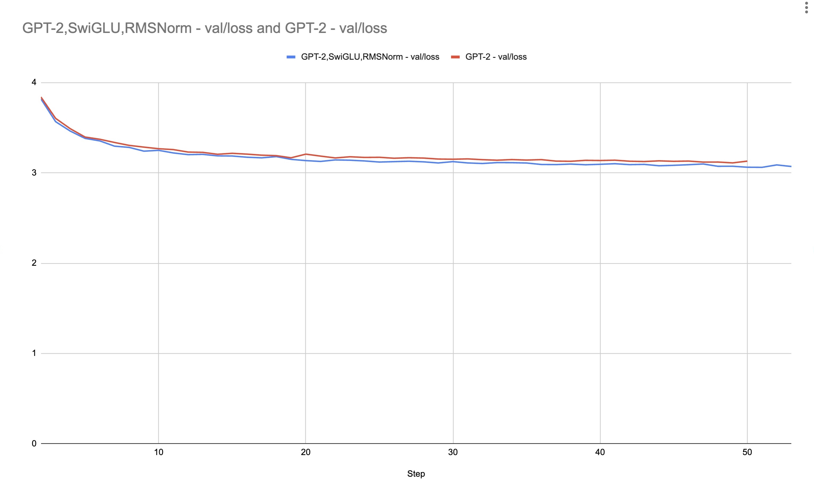

# GPT-2 Implementation from Scratch

Welcome to the GitHub repository of my from-scratch implementation of GPT-2. My goal is to study the architecture, impacts of other architectures and scaling laws. The initiative serves as an educational resource for myself and others interested in understanding and experimenting with the mechanisms of GPT-2. 

## Project Status

  

Here is a study of the validation loss for the original GPT-2 implementation versus a modified GPT-2 with SwiGLU and RMS Norm. The regular Feed Forward Network (FFN) with 2 linear layers is replaced with an FFN-SwiGLU ([SwiGLU Paper](https://arxiv.org/pdf/2002.05202.pdf)) in each layer (total of 12 layers). Additionally, in each layer, an RMS Norm layer replaces the regular normalization layer.

These changes lead to an improvement in training. Although the percentage improvement in validation loss is not very high, faster convergence is obtained. Here, the validation loss for 50k iterations is reached with 40% fewer (30k) iterations with the modified architecture. The FFN-SwiGLU parameters are adjusted so that its total parameter count approximately matches the regular FFN for a more fair comparison.

### Caveats
- Hyperparameter optimization is required to fully establish the differences. Here, we note the trends at a single setting of all hyperparameters.
- Dropout was used after the output of regular FFN, but not in SwiGLU FFN.
- Scaled initialization was used to initialize the weights of the final layer of the regular FFN (per GPT-2 paper), but not in SwiGLU FFN. Instead, the default mean 0 sigma 0.02 initialization was used.

## Features

- **Replication of GPT-2 Architecture**: Implements the multi-layer transformer model, for the most part, as described in the original GPT-2 paper. OpenAI tensorflow implementation, Pytorch GPT-2 implementation and Karpathy's nanoGPT project have been important references in this atttempt

## Training
This assumes that you have a cluster of GPUs, similar to vast.ai, with CUDA, pytorch installed. 
First, install dependencies. Prepare data. Then launch DDP run, assunming single node with 8 GPUs. 
OpenWebText dataset is downloaded by default. 

git clone https://github.com/veetil/gpt
 
cd gpt 
 
pip install -r requirements.txt
 
python data/prepare.py 
 
wandb login
 
torchrun --standalone --nproc_per_node=8 train.py

## References
https://arxiv.org/pdf/2002.05202.pdf
 
https://arxiv.org/abs/2204.02311
 
https://github.com/karpathy/nanoGPT
 
https://github.com/openai/gpt-2
 
https://github.com/huggingface/transformers/tree/main/src/transformers/models/gpt2

